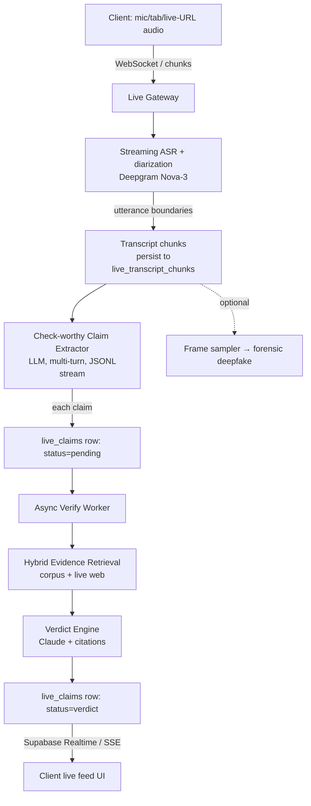

# Unfaked Expansion Plan — Text Verification & Live Video Fact-Checking

> Status: PROPOSED (draft for review) · Author: AI planning pass · Date: 20 Jun 2026
> Scope: Add (A) text/claim verification and (B) live video/audio fact-checking to the Unfaked product.
> Read alongside: `context/IMPLEMENTATION_PLAN.md`, `context/technical/master-architecture-spec-summary.md`,
> `context/technical/rag-pipeline-detail.md`, `context/technical/detection-pipeline-detail.md`,
> `context/legal/defamation-liability-memo.md`, `context/legal/legal-risk-register.md`.

---

## 0. TL;DR

We extend Unfaked from "paste a video URL → deepfake verdict" to three capabilities:

1. **Text verification** — paste/snippet a claim → evidence-backed verdict. Reuses the existing
   `@fountem/rag` + `@fountem/verdict` stack, but adds a **live open-web evidence layer** (the current
   corpus is a closed UK-politics store, which is insufficient for general/live claims).
2. **Live video/audio fact-checking** — point Unfaked at a live debate/interview (YouTube/X live URL,
   uploaded stream, or mic/tab capture) and get a **streaming feed of claims** that flip from
   `pending → checking → verdict` in real time, plus optional **frame-level deepfake** checks on the
   live feed.
3. **Real-time delivery** — a new event-driven pipeline (ASR → claim extraction → async verification →
   push to UI) built on Supabase Realtime / SSE, decoupled from the current 60s blocking request model.

This is a **net-new architecture** for (2). It is achievable by composing the existing pipeline pieces
plus four new primitives: a **streaming ASR stage**, a **check-worthy claim extractor**, a **live
evidence retriever**, and a **realtime fan-out layer**.

The dominant constraint is **not technical, it is legal**: live fact-checking of named politicians,
especially during a regulated election period, collides directly with the defamation/RPA s.106 posture
in `context/legal/`. The plan treats live verdicts as **provisional, AI-generated, assistive** output
with hard guardrails (no strong adverse character verdicts on named individuals, prominent disclaimers,
post-hoc human review for archival/publication).

---

## 1. Where we are today (baseline)

| Capability | Today | Package | Entry point |
|---|---|---|---|
| Video deepfake detection | ✅ async, <60s, URL-in | `@fountem/detection` | `apps/unfaked` `POST /api/detect` |
| Text claim verification | ✅ but **on Fountem only**, closed UK corpus | `@fountem/rag` | `apps/fountem` `POST /api/verify` |
| Live / streaming anything | ❌ none | — | — |
| Real-time delivery | ❌ single blocking POST | — | — |
| Live web/news retrieval | ❌ none (pre-ingested corpus only) | — | — |

Shared, reusable infrastructure (already cross-product):
- `@fountem/core` — auth, per-IP rate limit, per-user daily quota, global budget circuit-breaker,
  API keys, SSRF URL guard, monitoring, mock mode.
- `@fountem/verdict` — unified `VerdictCard` (`type: 'detection' | 'claim_check'`), `VERDICT_META`,
  serialisers, correction-pack permalinks.
- `@fountem/db` — single Supabase instance; `claims`, `verdicts`, `evidence_*`, `video_detections`,
  `correction_packs`, quota RPCs (`increment_user_usage`, `increment_global_budget`).
- `@fountem/ui` — `Button`, `Card`, `StatusChip`, `ConfidenceGauge`, `SignalBar`.
- `services/resolver` — AWS ECS service: `yt-dlp`, `ffprobe`, `c2patool`, SSRF-safe DNS.

Key reuse insight: **the verdict data model, auth/quota stack, and correction-pack permalink system are
already product-agnostic.** We are mostly adding new *pipelines* and *surfaces*, not rebuilding plumbing.

---

## 2. Strategic decisions — LOCKED (Elroy, 20 Jun 2026)

These were genuine product/strategy forks. All five are now decided.

### D1 — Text verification relationship to Fountem → **SHARED ENGINE, TWO FRONT DOORS** ✅
Keep **one shared engine** (`@fountem/rag` + a new live-evidence layer) and expose it through Unfaked's
surface as **"verify any claim"**, while Fountem keeps the deep, dossier-grade UK political experience
(parties/issues/track-record). Same backend, two front doors. Unfaked = fast, consumer, general;
Fountem = deep, analyst, UK-politics. **No engine fork.**

### D2 — Live-video input source → **PASTE A LIVE URL** ✅
The primary input is a **live URL** (YouTube Live / X / Twitch / news HLS). The `services/live-gateway`
(with help from a resolver capability) pulls the stream, extracts the audio track, and feeds streaming
ASR. This is the highest-reach option; it carries continuous-pull infra cost and platform-ToS
considerations that the gateway must handle (yt-dlp/ffmpeg HLS pull, reconnection, rate limiting).
> Note: browser mic/tab capture and upload remain possible later as alternate inputs, but **live URL is
> the build target for v1.**

### D3 — Live deepfake vs live claim-checking → **CLAIMS FIRST** ✅
Build live **claim-checking first** (audio → transcript → claims → evidence → verdict). Add **periodic
frame sampling** for deepfake as a secondary signal in a later phase (sample 1 frame / N seconds →
existing `@fountem/detection` forensic detectors), not full-stream analysis.

### D4 — Evidence for live/general claims → **HYBRID (corpus + live web)** ✅
Tiered retrieval: (1) existing trusted corpus first, (2) **live web search** (Tavily) as
fallback/augmentation, (3) optionally cache web results into the corpus over time. Surface source tier
in the UI ("checked against primary sources" vs "checked against web sources").

### D5 — Verdict authority for live output → **PROVISIONAL, CONSUMER-CAPPED** ✅
Audience for v1 is **signed-in consumers, tightly capped**. Live verdicts are **explicitly provisional**:
badge "Live · AI-assisted · not yet reviewed", restrict the live verdict vocabulary (`supported /
disputed / needs-context / unverifiable` rather than blunt "FALSE"), and **never** auto-publish live
verdicts to the public archive or bot. Promotion to a permanent, citable Correction Pack requires the
existing human-review gate. Named-politician character guardrails on by default; election-period flag.

---

## 3. Target architecture

### 3.1 Capability map

```
                         ┌────────────────────────── UNFAKED ──────────────────────────┐
   Async (today)         │  POST /api/detect   ── video URL ──▶ @fountem/detection      │
   Async (new, text)     │  POST /api/verify-text ── claim ──▶ @fountem/rag + live web  │
   Live (new)            │  /api/live/* (session) ── audio stream ──▶ live pipeline      │
                         └──────────────────────────────────────────────────────────────┘
```

### 3.2 Live pipeline (the new system)

Event-driven, asynchronous, decoupled stages (mirrors the state of the art: ASR → claim extraction →
async verify → realtime push):



Design principles carried over from the references and our constraints:
- **Decouple extraction throughput from verification latency** — claim insertion triggers an async
  verify job; the ASR/extraction loop never blocks on fact-checking.
- **Stream claims individually** (JSONL line-by-line from the extractor) so they appear as fast as
  possible as `pending`.
- **Multi-turn extraction session** per live session so we don't re-extract already-seen claims and can
  resolve pronouns/references using prior context.
- **Idempotency + dedup**: hash claim text within a session; skip re-verifying near-duplicates.
- **Backpressure & budget**: per-session caps (max claims/min, max session minutes) feed the existing
  global budget circuit-breaker.

### 3.3 Where each stage runs

| Stage | Runtime | Rationale |
|---|---|---|
| Live gateway / WebSocket | **New long-lived service** (not Vercel serverless) — Node service on the same AWS/Fly/Render footprint as `services/resolver`, or a dedicated `services/live-gateway` | Vercel functions cap at 60s and don't hold WebSockets well |
| Streaming ASR | Deepgram Nova-3 streaming (managed) | Sub-300ms, diarization, $/hr predictable (see §7) |
| Claim extraction | LLM call from the gateway/worker | Fast model (GPT-4o-mini / Gemini Flash / Groq Llama) for latency |
| Verify worker | Background worker (queue-driven) | Reuses `@fountem/rag` verdict engine |
| Evidence retrieval | `@fountem/rag` + new web-search adapter | Hybrid corpus + web |
| Realtime fan-out | Supabase Realtime (Postgres changefeed) or SSE from gateway | Already have Supabase; realtime subscriptions push row changes to UI with no polling |
| Frame deepfake (later) | `services/resolver` frame grab → `@fountem/detection` | Reuse forensic detectors on sampled frames |

> **Why a new service, not Vercel:** the existing async model is request/response within 60s. Live needs
> persistent connections, streaming ASR sockets, and worker queues. We add `services/live-gateway`
> (Dockerized, same deploy pattern as `services/resolver`) rather than forcing this into Next.js routes.

---

## 4. Part A — Text verification on Unfaked

### 4.1 Backend
- **Reuse** `@fountem/rag` (`hybridRetrieve`, `generateVerdict`) and `@fountem/verdict`
  (`serialiseClaimVerdict`). Add `@fountem/rag` + `@fountem/verdict` to `apps/unfaked/package.json` and
  `next.config.ts` `transpilePackages`.
- **New route** `apps/unfaked/src/app/api/verify-text/route.ts`, modeled on Fountem's
  `/api/verify` and Unfaked's `/api/detect`, with these improvements over the current Fountem route:
  - **Claim caching/dedup** by `sha256(normalised_claim_text)` *before* charging quota (Fountem currently
    re-runs + re-charges on identical text — fix this here).
  - **Quota product** `'unfaked'` (5/day default) via `increment_user_usage`.
  - Charge quota **after** a successful run (Fountem charges before; avoid burning slots on failure).
  - Store `submitted_by` and the actual `user_id`.
- **New live-evidence layer** (the important upgrade): add a retrieval adapter package or module
  `packages/rag/src/web-search.ts` exposing `webSearchEvidence(query)` backed by **Tavily** or
  **Perplexity Sonar**, returning normalized chunks with URLs + excerpts that slot into the existing
  `RetrievedChunk[]` shape so `generateVerdict` (Claude + Citations API) is unchanged.
  - Retrieval policy: corpus-first; if corpus confidence/coverage is low, augment with web; tag each
    citation with `source_tier: 'primary' | 'web'`.
  - Add a small **source-credibility score** for web domains (allowlist + heuristics) so web evidence is
    weighted below primary sources, consistent with the existing source hierarchy.

### 4.2 Data model
- Reuse `claims` + `verdicts` + `correction_packs`. Add migration:
  - `claims.input_kind text` (`'text' | 'video' | 'live'`) and proper `claim_type` classification
    (replace the hardcoded `'statistic'`).
  - `verdicts.evidence_tier` / extend `source_citations` JSONB with `source_tier`.
  - New `source_type` enum values for general/web evidence (current CHECK constraint is UK-specific).
  - A `claim_hash` column + unique index for dedup/caching.

### 4.3 Website / UI (Unfaked)
- Home page: add a **mode switcher** to the hero — `Video URL | Text claim | Live` (segmented control),
  reusing the dark forensic aesthetic.
- New `TextClaimForm.tsx` (adapt Fountem's `ClaimCheckForm` to Unfaked styling) → `POST /api/verify-text`
  → render via `VerdictPanel` extended to branch on `card.type === 'claim_check'` (show citations,
  `what_would_change_this`, source tiers; hide forensic layer breakdown).
- New route `/verify` (text), keep `/check/[slug]` permalink working for claim packs too.
- Methodology page: add a "How text verification works" section.

### 4.4 Effort estimate (Part A): **~1–2 weeks** (mostly wiring + web-search adapter + UI), since the
RAG engine and verdict UI already exist.

---

## 5. Part B — Live video/audio fact-checking

### 5.1 New package: `@fountem/live`
A new workspace package holding the pure, testable pipeline logic (mirrors how `@fountem/detection`
and `@fountem/rag` isolate logic from the app):

```
packages/live/src/
  asr.ts            # provider-agnostic streaming ASR adapter (Deepgram impl)
  diarization.ts    # speaker labelling helpers
  claim-extractor.ts# check-worthy claim detection (LLM, multi-turn session, JSONL stream)
  session.ts        # LiveSession state machine + dedup + backpressure
  verify-worker.ts  # consumes pending claims → hybridRetrieve(+web) → generateVerdict
  frame-sampler.ts  # (phase 2) periodic frame grab → @fountem/detection
  types.ts          # LiveSession, LiveTranscriptChunk, LiveClaim, LiveVerdict
  mock.ts           # deterministic offline fixtures (MOCK_SERVICES=1)
```

Reuses `@fountem/rag` (retrieval + verdict), `@fountem/verdict` (serialisation),
`@fountem/detection` (frame deepfake), `@fountem/core` (budget/quota/monitoring).

### 5.2 New service: `services/live-gateway`
- Dockerized Node service (same infra pattern + Terraform style as `services/resolver`).
- Responsibilities: hold client WebSocket, open Deepgram streaming socket, run the extraction loop, write
  transcript/claim rows to Supabase, enqueue verify jobs, enforce per-session caps.
- Auth: short-lived signed session token minted by an Unfaked API route after the normal auth/quota check
  (so the gateway trusts the web app, not the raw client).
- Scaling: one worker per active session (lightweight); a queue (e.g. Postgres queue, Redis/Valkey list,
  or SQS) for verify jobs so verification scales independently.

### 5.3 Live session flow (client ↔ gateway)
1. Client calls `POST /api/live/start` (Unfaked) → auth + quota check → returns `{ session_id, gateway_url, token }`.
2. Client opens WebSocket to gateway, streams audio chunks (mic/tab capture via `MediaRecorder`/WebRTC,
   or gateway pulls a live URL via resolver).
3. Gateway → Deepgram → transcript chunks persisted to `live_transcript_chunks` (with speaker label).
4. On utterance boundary (~1.5s silence), unprocessed chunks → claim extractor (multi-turn) → stream
   `live_claims` rows as `pending`.
5. Each new claim enqueues a verify job → worker runs hybrid retrieval + verdict → updates row to
   `checking` then final `verdict` with citations.
6. Client subscribes via **Supabase Realtime** to `live_claims where session_id = ...` → UI updates
   instantly (pending → checking → verdict), no polling.
7. `POST /api/live/stop` ends the session; optionally generate a **session summary** (a Correction-Pack-
   style recap of notable claims) that *can* be submitted to the human-review queue for archival.

### 5.4 Data model (new migration)

```sql
create table live_sessions (
  id uuid primary key default gen_random_uuid(),
  user_id uuid references auth.users,
  source_kind text check (source_kind in ('mic','tab','live_url','upload')),
  source_ref text,                 -- e.g. live URL (nullable for capture)
  status text default 'active',    -- active | ended | error
  started_at timestamptz default now(),
  ended_at timestamptz
);

create table live_transcript_chunks (
  id uuid primary key default gen_random_uuid(),
  session_id uuid references live_sessions on delete cascade,
  speaker_label text,              -- diarization output (Speaker 0/1...)
  text text not null,
  ts_start_ms int, ts_end_ms int,
  processed_for_claims boolean default false,
  created_at timestamptz default now()
);

create table live_claims (
  id uuid primary key default gen_random_uuid(),
  session_id uuid references live_sessions on delete cascade,
  transcript_excerpt text,
  claim_text text not null,
  speaker_label text,
  status text default 'pending',   -- pending | checking | supported | disputed | needs_context | unverifiable | error
  verdict_summary text,
  correction text,
  confidence_pct int,
  source_citations jsonb default '[]',
  claim_hash text,                 -- session-scoped dedup
  verified_at timestamptz,
  created_at timestamptz default now()
);

create index live_claims_by_session_status on live_claims (session_id, status);
```

RLS: a session's owner can read their own session rows; **no public read** of live rows (avoids
intermediary-liability / unreviewed publication). Realtime enabled on `live_claims`.

### 5.5 Website / UI (Unfaked) — live experience
- New route `/live` with three layouts:
  - **Setup**: choose source (mic / browser tab audio / paste live URL), consent + disclaimer modal
    ("Live AI-assisted fact-checking — provisional, not verified").
  - **Live console** (the core UX): split view —
    - left: live transcript with speaker labels scrolling;
    - right: **claim feed** cards that animate `pending (grey) → checking (amber) → verdict (colour)`,
      each with claim text, short verdict, confidence, and expandable citations.
  - **Recap**: post-session summary of notable claims; "Save as Correction Pack" (→ review queue).
- Components: `LiveSetup.tsx`, `LiveConsole.tsx`, `LiveTranscript.tsx`, `LiveClaimCard.tsx`,
  `useLiveSession.ts` (WebSocket + Supabase Realtime subscription hook).
- Strong, always-visible **disclaimer banner** in live mode (legal requirement, see §8).
- Accessibility: live captions double as a captioning feature (nice secondary value).

### 5.6 Effort estimate (Part B): **~5–8 weeks** for MVP (mic/tab capture, ASR, extraction, hybrid
verify, realtime UI), excluding live-URL pull and frame-level deepfake (add ~2–3 weeks each).

---

## 6. Provider selection

| Need | Recommended | Alternatives | Notes |
|---|---|---|---|
| Streaming ASR + diarization | **Deepgram Nova-3** (~250–300ms, ~$0.26–0.46/hr) | AssemblyAI Universal-Streaming (~$0.15/hr, 6 langs); Speechmatics (55+ langs) | Deepgram is the de-facto live standard; diarization built in |
| Claim extraction (latency-critical) | **GPT-4o-mini** (already in stack) or **Gemini 2.0/2.5 Flash** / **Groq Llama 3.3** | — | Keep one provider to limit surface; Groq fastest if needed |
| Verdict engine | **Claude Sonnet** + Citations API (already in `@fountem/rag`) | — | Unchanged; grounded, citable |
| Live web evidence | **Tavily** | Perplexity Sonar; NewsAPI/GNews + scrape | Tavily is purpose-built for LLM evidence retrieval |
| Embeddings (corpus) | OpenAI `text-embedding-3-small` (already) | — | Unchanged |
| Realtime fan-out | **Supabase Realtime** (already have Supabase) | SSE from gateway; dedicated WS | Lowest new infra |
| Frame deepfake (phase 2) | Existing Hive/Sensity via resolver | — | Sample frames, don't stream-analyse |

All new providers get a **mock implementation** behind `MOCK_SERVICES=1` so CI and `dev:mock` keep
working offline (consistent with current repo convention).

---

## 7. Cost & scaling model (rough)

Per **1 hour live session** (order-of-magnitude):
- ASR (Deepgram): ~$0.30–0.46
- Claim extraction (fast LLM): depends on talk density; ~$0.05–0.30
- Verification (retrieval + Claude per claim): the cost driver. A debate may yield 30–120 check-worthy
  claims/hour. At a few cents per verified claim → **~$1–5/hr**.
- Web search (Tavily) per claim: small, but adds up at volume.

Implications:
- Add a **live-specific quota** + **per-session caps** (max minutes, max claims/min) and wire into the
  existing **global budget circuit-breaker** (`service_budget`). Live can blow budgets fast.
- B2B framing: per the cost/revenue docs, "real-time" is a **newsroom/B2B tier** — meter live minutes,
  not free-for-all consumer. Consumer live MVP should be tightly capped (e.g. short sessions, signed-in
  only).

---

## 8. Legal & compliance (gating — read `context/legal/` first)

Live fact-checking amplifies every existing risk. Non-negotiables, derived from
`defamation-liability-memo.md` and `legal-risk-register.md`:

1. **Provisional framing.** Live verdicts are AI-generated, unreviewed, assistive. Badge every live
   verdict and show the standard disclaimer + `what_would_change_this`. Never present a live verdict as
   definitive proof.
2. **Restricted live verdict vocabulary.** Prefer `supported / disputed / needs-context / unverifiable`
   over blunt "FALSE/LIE". No statements about a **named individual's personal character or conduct**
   (RPA s.106 risk during election periods).
3. **No auto-publication.** Live claims/verdicts are **private to the session** (RLS), **not** written to
   the public `/cases` archive or sent via the bot. Promotion to a permanent, public Correction Pack
   requires the existing **human-review gate**.
4. **Election-period protocol.** A feature flag to tighten or disable named-candidate live verdicts
   during regulated periods (already a documented P0 risk, R-7).
5. **EU AI Act (Art. 50, effective Aug 2 2026).** Live AI-generated verdict text needs AI-generation
   disclosure — bake into the live UI.
6. **Right of reply / takedown.** Corrections SLA applies to anything that becomes public. Keep live
   sessions ephemeral by default (retention policy on `live_*` tables).
7. **Data protection / consent.** Capturing audio (esp. third-party broadcasts/mic) → update DPIA,
   privacy policy, and add explicit in-product consent. Don't store raw audio; store transcript +
   verdicts only, with a retention TTL.
8. **Insurance (R-15).** Public live use likely should wait until media-liability insurance or written
   risk acceptance is in place.

**Recommendation:** launch live as **signed-in, capped, clearly-provisional**, with named-politician
guardrails on by default. Counsel sign-off on live verdict wording is a blocking pre-launch item.

---

## 9. Phased delivery

| Phase | Deliverable | Depends on | Est. |
|---|---|---|---|
| **A1** | Text verification on Unfaked (corpus only), reuse RAG + verdict UI | none | 1 wk |
| **A2** | Live web evidence layer (Tavily) + source tiers + dedup/cache | A1 | 1 wk |
| **B0** | `@fountem/live` package skeleton + mocks + data model migration | A1 | 1 wk |
| **B1** | `services/live-gateway` + **live-URL pull (yt-dlp/ffmpeg HLS → audio)** + Deepgram streaming ASR + transcript persistence | B0 | 2 wk |
| **B2** | Claim extractor (multi-turn, JSONL) + async verify worker (reuse A2 retrieval) | B1, A2 | 1.5 wk |
| **B3** | `/live` UI: setup (paste live URL) → console (transcript + live claim feed via Supabase Realtime) | B2 | 1.5 wk |
| **B4** | Legal guardrails, disclaimers, quotas/budget, election flag, consent/DPIA | B3 | 1 wk |
| **B5** | Recap + "save as Correction Pack" → human-review queue | B3 | 0.5 wk |
| **C1** | (Later) Frame-sampled live deepfake via `@fountem/detection` | B-series | 2–3 wk |
| **C2** | (Later) Alternate inputs: browser mic/tab capture + upload | B-series | 2 wk |

MVP = A1 + A2 + B0–B5 (text + **live-URL** fact-checking). Roughly **8–10 weeks** of focused build.

---

## 10. Concrete change inventory (for implementation)

### New
- `packages/live/` — new package (`@fountem/live`).
- `services/live-gateway/` — new Dockerized service (Terraform like `services/resolver/infra/`).
- `packages/rag/src/web-search.ts` — live web evidence adapter (Tavily/Sonar) + mock.
- `apps/unfaked/src/app/api/verify-text/route.ts` — text verification route.
- `apps/unfaked/src/app/api/live/start/route.ts`, `.../live/stop/route.ts` — session lifecycle.
- `apps/unfaked/src/app/(site)/verify/page.tsx`, `.../live/page.tsx` — new surfaces.
- `apps/unfaked/src/components/TextClaimForm.tsx`, `LiveSetup.tsx`, `LiveConsole.tsx`,
  `LiveTranscript.tsx`, `LiveClaimCard.tsx`, `apps/unfaked/src/lib/useLiveSession.ts`.
- `supabase/migrations/0NN_live_sessions.sql`, `0NN_claims_text_extensions.sql`.

### Modified
- `apps/unfaked/package.json` + `next.config.ts` — add `@fountem/rag`, `@fountem/verdict`,
  `@fountem/live` to deps + `transpilePackages`.
- `packages/verdict/src/serialiser.ts` — ensure claim cards serialise with source tiers; add a `live`
  variant if needed.
- `apps/unfaked/src/components/VerdictPanel.tsx` — branch on `card.type` to render claim citations.
- `apps/unfaked/src/app/(site)/page.tsx` — hero mode switcher (Video / Text / Live).
- `apps/unfaked/src/app/(site)/methodology/page.tsx` — document new methods.
- `@fountem/core` quota — add `live` product limits + per-session caps.
- `.env.example` / Vercel + service env — `DEEPGRAM_API_KEY`, `TAVILY_API_KEY`, `LIVE_GATEWAY_URL`,
  `LIVE_SESSION_SIGNING_KEY`.
- Legal docs: `dpia.md`, privacy/consent pages, `legal-risk-register.md` (add live entries),
  `compliance-checklist.md` (add live pre-launch gates).
- `.github/workflows/deploy.yml` — add live-gateway deploy (or AWS pipeline like resolver).

### Tests
- Unit: claim extractor (fixtures), verify worker, web-search adapter, dedup/cache, serialisers.
- Integration: mock live session end-to-end under `MOCK_SERVICES=1`.
- Eval: extend `scripts/eval-harness.ts` with live-style claim batches.

---

## 11. Key risks & mitigations

| Risk | Mitigation |
|---|---|
| Legal exposure on named individuals (live, election) | Provisional framing, restricted vocabulary, no auto-publish, election flag, counsel sign-off |
| Cost blowout on busy live sessions | Per-session caps, live quota, global circuit-breaker, B2B metering |
| Latency too high to feel "live" | Deepgram sub-300ms ASR; decouple extraction from verification; stream claims as `pending` immediately |
| Hallucinated/over-eager claim extraction | Check-worthiness filter, multi-turn dedup, conservative thresholds, `unverifiable` default |
| Web evidence quality | Source-credibility scoring, corpus-first, tier labelling in UI |
| Vercel can't host live | Dedicated `services/live-gateway`; Vercel only mints tokens |
| Scope creep / duplicating Fountem | One shared engine, two front doors (D1) |

---

## 12. Open questions for sign-off
1. **D1–D5** decisions above — confirm direction (esp. live input source D2 and verdict authority D5).
2. Consumer vs B2B-first for live? (affects quotas, gating, and whether live is public at all initially).
3. Acceptable retention for live transcripts/claims (ephemeral vs saved)?
4. Budget ceiling for live per month (drives caps + circuit-breaker thresholds)?
5. Is counsel review of live verdict wording achievable before any public live launch?
```
